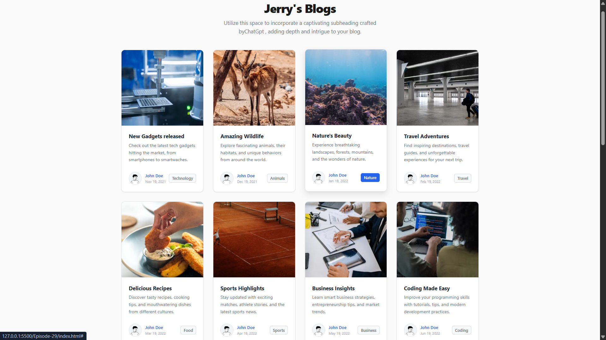

# Jerry's Blogs

A modern and responsive blog website built using HTML, CSS, and JavaScript. The project features clean blog cards with dynamic category-based images fetched from the Pexels API. Every page refresh loads new images while maintaining their assigned categories, creating a fresh and engaging user experience.

---

## 🚀 Features

- Responsive blog card layout
- Dynamic images using the Pexels API
- Different image categories for each blog card
- Random image refresh on every page reload
- Clean and modern user interface
- Hover effects and smooth transitions
- Organized and beginner-friendly code structure

---
## 📸 Preview



## 🛠️ Technologies Used

- HTML5
- CSS3
- JavaScript (ES6)
- Pexels API

---

## 📂 Project Structure

```
jerrys-blogs/
├── assets/
│   └── preview.png
├── index.html
├── style.css
├── script.js
├── images/
└── README.md
```

---

## 📸 Categories Included

- Technology
- Animals
- Nature
- Travel
- Food
- Sports
- Business
- Coding
- Fashion
- Health
- Education
- Music
- Gaming
- Architecture
- Art
- Space
- Fitness
- Lifestyle

---

## 🔑 API

This project uses the **Pexels API** to fetch high-quality royalty-free images dynamically.

To use your own API key:

1. Create a free account on Pexels.
2. Generate an API key.
3. Replace the existing key in `script.js`:

```javascript
const API_KEY = "YOUR_PEXELS_API_KEY";
```

---

## 📷 Preview

A responsive blog website displaying dynamic category-based blog cards with randomly refreshed images.

---

## 👨‍💻 Author

**Krishnendu Guria**

---
